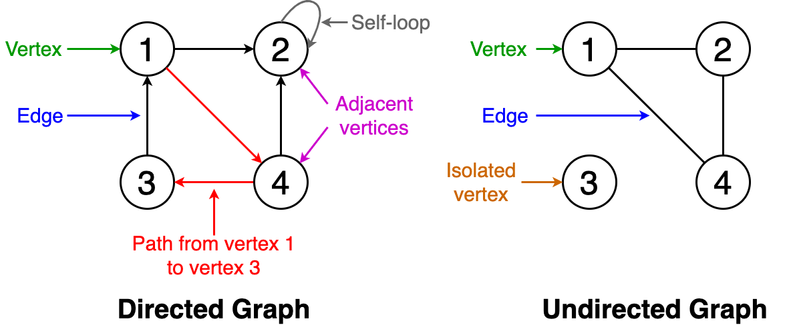
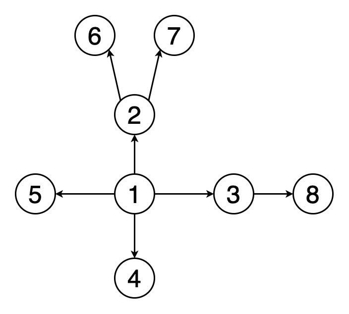
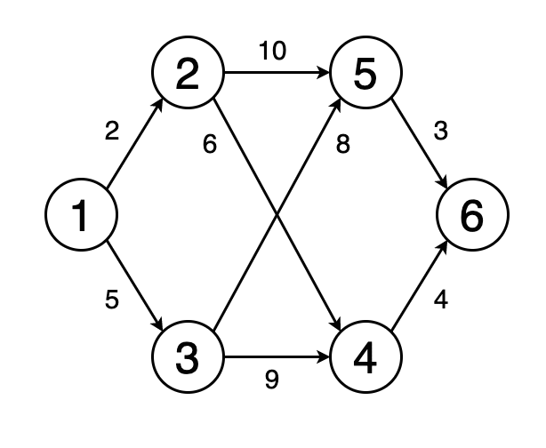
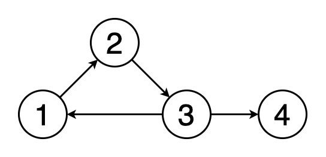
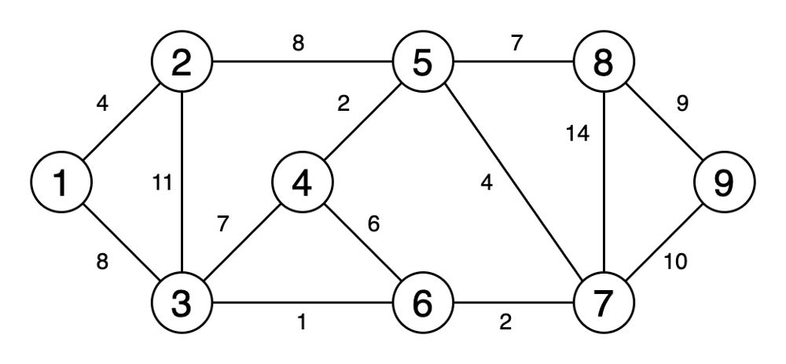
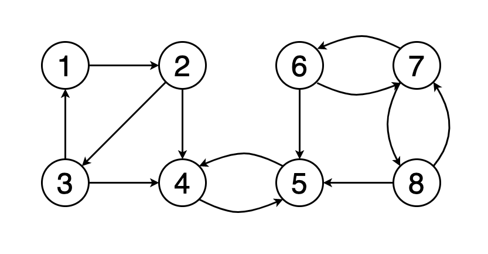
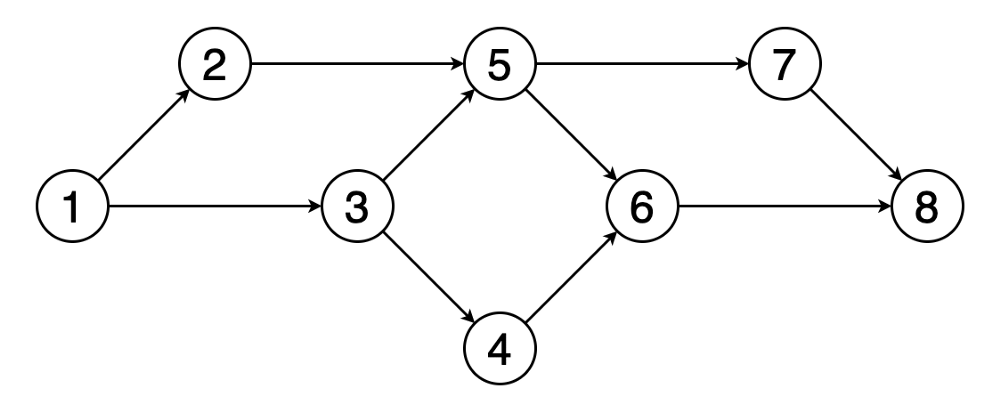
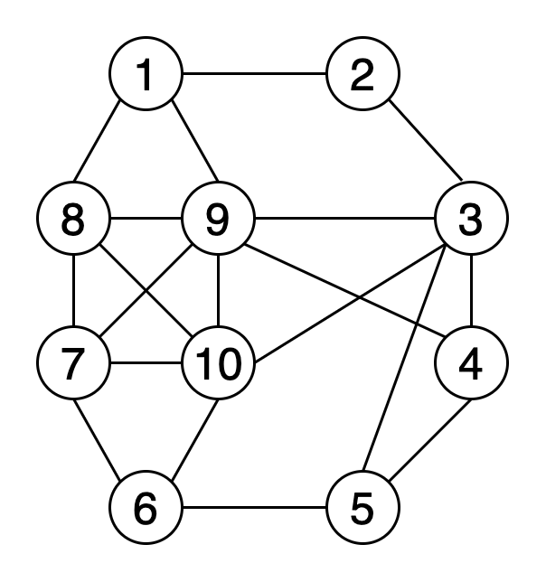
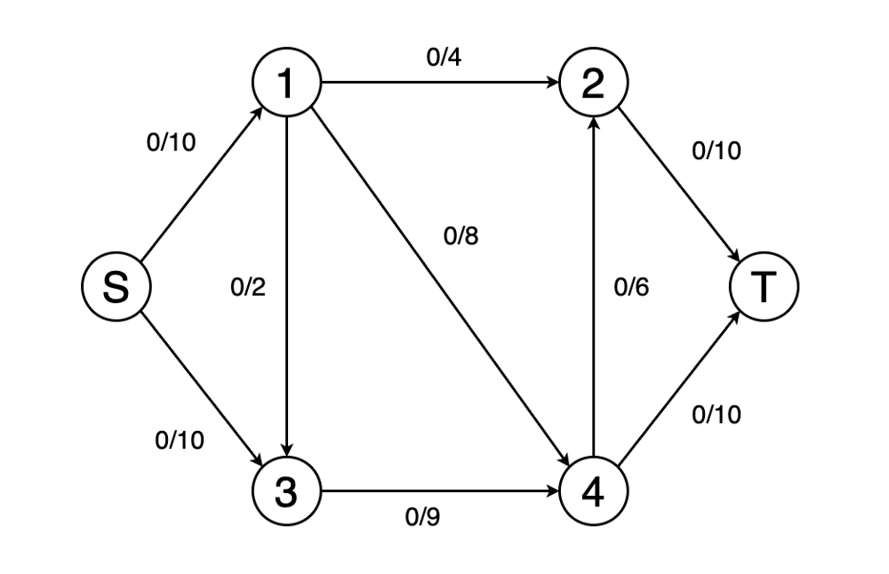
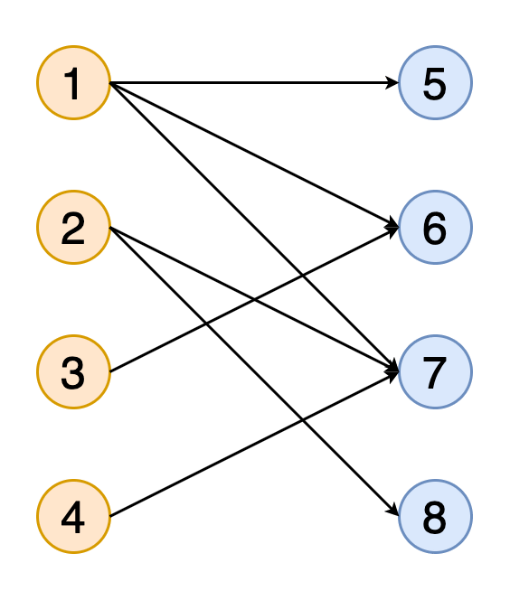

A `graph` consists of a finite set of `vertices` (or `nodes`) and a set of `edges`, connecting the vertices. Two verticies are said to be `adjacent` if they are connected to each other by the same edge.

A graph is `connected` when there is a path between every pair of vertices. In a connected graph, there are no unreachable vertices. A graph that is not connected is `disconnected`.

`Order` - the number of vertices in a graph.

`Size` - the number of edges in the graph.

`Vertex degree` - the number of edges that are incident to a vertex.

`Isolated vertex` - a vertex that is not connected to any other vertices in the graph.

`Self-loop` - an edge from a vertex to itself.

`Cycle` - a path in a graph where the first and last vertices are the same.

`Directed graph` - a graph where all the edges have a direction indicating what is the start vertex and is the end vertex.

`Undirected graph` - a graph width edges that have no direction.

`Weighted graph` - edges of the graph have weights.

`Unweighted graph` - edges of the graph has no weights.

`Minimum spanning tree` - a subset of the edges of a graph that connects all the vertices with the minimum sum of edge weights and consists of no cycles.

A graph is said to be `strongly connected` if every vertex in the graph is reachable from every other vertex (e.g., if in a directed graph you can reach vertex 5 from vertex 6, but not the other way around, vertex 5 does not belong to a connected component containing vertex 6).

## 1. Breadth-first search

We start at a particular vertex and explore all of its neighbours at the present depth before moving on to the vertices in the next level. Unlike trees, graphs can contain cycles (a path where the first and last vertices are the same). Hence, we have to keep track of the visited vertices. When implementing BFS, we use a queue data structure.

Below is the animation of a BFS traversal. Note how vertices are discovered (yellow) and get visited (red).

### Applications

* Used to determine the shortest paths and minimum spanning trees.
* Used by search engine crawlers to build indexes of web pages.
* Used to search on social networks.
* Used to find available neighbour nodes in peer-to-peer networks such as BitTorrent.

## 2. Depth-first search

We start from a particular vertex and explore as far as possible along each branch before retracing back (backtracking). We also have to keep track of the visited vertices. When implementing DFS, we use a stack data structure to support backtracking.

Below is the animation of a DFS traversal.

### Applications

* Used to find a path between two vertices.
* Used to detect cycles in a graph.
* Used in topological sorting.
* Used to solve puzzles having only one solution (e.g. mazes).

## 3. Shortest path

The shortest path from one vertex to another is a path in the graph such that the sum of the weights of the edges that should be travelled is mininum.

Below is an animation where the shortest path is determined from vertex 1 to vertex 6.

### Algorithms

* Dijkstra’s shortest path algorithm
* Bellman–Ford algorithm

### Applications

* Used to find directions to travel from one location to another in mapping software like Google maps or Apple maps
* Used in networking to solve the min-delay path problem
* Used in abstract machines to determine the choices to reach a certain goal state via transitioning among different states (e.g., can be used to determine the minimum possible number of moves to win a game)

## 4. Cycle detection

### Algorithms

* Floyd cycle detection algorithm
* Brent’s algorithm

### Applications

* Used in distributed message-based algorithms
* Used to process large-scale graphs using a distributed processing system on a cluster
* Used to detect deadlocks in concurrent systems
* Used in cryptographic applications to determine keys of a message that can map that message to the same encrypted value

## 5. Minimum spanning tree

Below is the animation of obtaining a minimum spanning tree.

### Algorithms

* Prim’s algorithm
* Kruskal’s algorithm

## Applications

* Used to construct trees for broadcasting in computer networks
* Used in graph-based cluster analysis
* Used in image segmentation
* Used in regionalisation of socio-geographic areas, where regions are grouped into contiguous regions

## 6. Strongly connected components

Below is an example of a graph with three strongly connected components with vertices colored in red, green and yellow.

### Algorithms

* Kosaraju’s algorithm
* Tarjan’s strongly connected components algorithm

## Applications

* Used to compute the Dulmage–Mendelsohn decomposition, which is a classification of the edges of a bipartite graph
* Used in social networks to find a group of people who are strongly connected and make recommendations based on common interests

## 7. Topological sorting

`Topological sorting` of a graph is a linear ordering of its vertices so that for each directed edge (u, v) in the ordering, vertex u comes before v.

Below is an example of a topological ordering of vertices (1, 2, 3, 5, 4, 6, 7, 8).

### Algorithms

* Kahn’s algorithm
* The algorithm based on depth-first search

### Applications

* Used in instruction scheduling
* Used in data serialisation
* Used to determine the order of compilation tasks to perform in makefiles
* Used to resolve symbol dependencies in linkers

## 8. Graph coloring

`Graph coloring` assigns colors to elements of a graph while ensuring certain conditions. `Vertex coloring` is the most commonly used graph coloring technique. In vertex coloring, we try to color the vertices of a graph using `k` colors and any two adjacent vertices should not have the same color. Other coloring techniques include `edge coloring` and `face coloring`.

The `chromatic number` of a graph is the smallest number of colors needed to color the graph.

The example below shows vertex coloring using 4 colors.

### Algorithms

* Algorithms using breadth-first search or depth-first search
* Greedy colouring

### Applications

* Used to schedule timetable
* Used to assign mobile radio frequencies
* Used to model and solve games such as Sudoku
* Used to check if a graph is bipartite
* Used to colour geographical maps of countries or states where adjacent countries or states have different colours

## 9. Maximum flow

We can model a graph as a flow network with edge weights as flow capacities. In the `maximum flow` problem, we have to find a flow path that can obtain the maximum possible flow rate.

Here's an animated example of determining the maximum flow of a network and determining the final flow value.

### Algorithms

* Ford-Fulkerson algorithm
* Edmonds–Karp algorithm
* Dinic’s algorithm

### Applications

* Used in airline scheduling to schedule flight crews
* Used in image segmentation to find the background and the foreground in an image
* Used to eliminate baseball teams that cannot win enough games to catch up to the current leader in their division

## 10. Matching

A `matching` in a graph is a set of edges that does not have common vertices (i.e., no two edges share a common vertex). A matching is called a `maximum matching` if it contains the largest possible number of edges matching as many vertices as possible.

Here's an animation of obtaining the complete matching of a bipartite graph with two sets of vertices denoted in orange and blue.

### Algorithms

* Hopcroft-Karp algorithm
* Hungarian algorithm
* Blossom algorithm

### Applications

* Used in matchmaking to match brides and grooms (the stable marriage problem)
* Used to determine the vertex cover
* Used in transportation theory to solve problems in resource allocation and optimization in travel